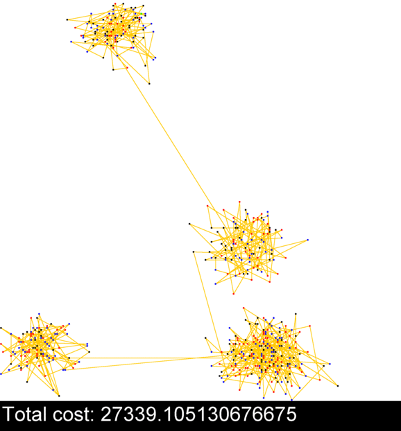

# Delivery Scheduling

## Participants
- Naldo Neves Monteiro Delgado (up201808613)
- Ricardo Antonio Pinto Da Cruz (up202008789)
- Tiago Rocha Silveira Pires (up202008790)

## Overview
This project aims to optimize package delivery scheduling using various heuristic algorithms. It provides a menu-driven interface to configure the optimization process and select the desired algorithm.

## How to Run (Developed on IntelliJ IDEA)
1. Clone the repository to your local machine.
2. Open IntelliJ IDEA.
3. Choose "Open" from the IntelliJ IDEA welcome screen and select the cloned project directory.
4. Once the project is open, navigate to the `Main` class.
5. Right-click on the `Main` class and select "Run Main.main()" from the context menu.
6. Follow the on-screen instructions to navigate the menu and configure the optimization process.

## Usage
- Upon running the application, the menu will display the current configuration, which can be modified as desired.
- Options are provided to change configuration parameters or generate packages.
- Select the desired algorithm from the menu to begin the optimization process.
- Follow the on-screen instructions to configure the algorithm-specific parameters and execute the optimization.

## Development Environment
- This project was developed using IntelliJ IDEA.
- Other development environments can also be used, but the provided instructions are tailored to IntelliJ IDEA.

## Structure
- The project consists of multiple classes, each implementing a different heuristic algorithm for package delivery scheduling.
- Test classes are provided for each heuristic, allowing direct configuration changes and execution.

