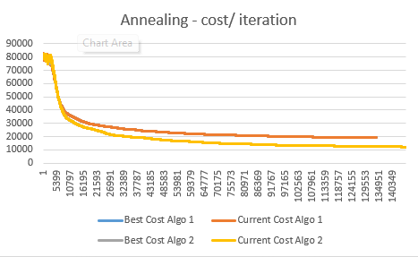

# Delivery Scheduling

## Overview
This project aims to optimize package delivery scheduling using various meta-heuristic algorithms. It provides a menu-driven interface to configure the optimization process and select the desired algorithm.

## How to Run (Developed on IntelliJ IDEA)
1. Clone the repository to your local machine.
2. Open IntelliJ IDEA.
3. Choose "Open" from the IntelliJ IDEA welcome screen and select the cloned project directory.
4. Once the project is open, navigate to the `Main` class.
5. Right-click on the `Main` class and select "Run Main.main()" from the context menu.
6. Follow the on-screen instructions to navigate the menu and configure the optimization process.

## Usage
- Upon running the application, the menu will display the current configuration, which can be modified as desired.
- Options are provided to change configuration parameters or generate packages.
- Select the desired algorithm from the menu to begin the optimization process.
- Follow the on-screen instructions to configure the algorithm-specific parameters and execute the optimization.

## Development Environment
- This project was developed using IntelliJ IDEA.
- Other development environments can also be used, but the provided instructions are tailored to IntelliJ IDEA.

## Structure
- The project consists of multiple classes, each implementing a different heuristic algorithm for package delivery scheduling.
- Test classes are provided for each heuristic, allowing direct configuration changes and execution.

## Problem Formulation and Solution representation​
Our project aims to solve a package delivery optimization problem using various algorithms​
We are tasked with optimizing the delivery of packages in a given area, considering factors such as urgency, fragility, and distance.​

### Package Types:
1. Fragile packages: Have a chance of damage during transportation.
2. Normal packages: No risk of damage during transportation.
3. Urgent packages: Incur a penalty for delivery outside the expected time.

### Objective Function
Minimize the total cost, considering fragile damage, travel costs, and urgent delivery
penalties.
   
The solution is represented as a sequence of locations (nodes) that the delivery vehicle visits during its route. Each location corresponds to a package delivery point or depot. The order of these locations determines the delivery sequence. This representation was encoded as an array.​

__Minimize Fragile Damage__  
Fragile packages have a chance of damage (X%) for every kilometer traveled (Y),
incurring a cost of Z for each damaged package. The probability of a package
breaking is calculated as follows:

$$P_{\text{damage}} = 1 - (1 - X)^Y$$
Pdamage is calculated for all fragile objects when they arrive at the destination. Then calculate whether the object is damaged or not.

__Minimize Travel Costs__  
Each kilometer traveled incurs a fixed cost C.

__Adhere to Urgent Delivery Constraints__  
Urgent packages incur a penalty for delivery outside the expected time, penalized by
a fixed amount for each minute of delay. The penalty per minute is equal to the fixed
costs C.

### Constraints:
1. You only have one vehicle available.
2. The delivery locations are specified by their coordinates.
3. Routes between all delivery coordinates are available.
4. The driver drives at 60km per hour and takes 0 seconds to deliver the goods.
5. The cost per km is C=0.3.

### Hard constraints​
- Time Window​
- Package Priority​
- You only have one vehicle available.

## Approach
We have decided to use the following meta-heuristics to solve this problem:

- Simulated Annealing: A probabilistic optimization algorithm inspired by the annealing process in metallurgy. It's used to find an approximate solution to optimization problems by iteratively exploring the solution space, allowing occasional uphill moves to escape local optima. It gradually decreases the probability of accepting worse solutions as it progresses.

- Hill Climbing: A basic optimization algorithm that starts with an arbitrary solution to a problem and iteratively moves to a neighboring solution with a higher value (if any). It continues this process until it reaches a peak where no neighboring solution has a higher value. It's simple but often gets stuck in local optima.

- Genetic Algorithms: Inspired by the process of natural selection, genetic algorithms are a type of evolutionary algorithm used for optimization. They maintain a population of candidate solutions and iteratively evolve them through processes such as selection, crossover, and mutation. Solutions with higher fitness (better solutions) are more likely to be selected and passed on to subsequent generations.

- Tabu Search: A metaheuristic algorithm for solving combinatorial optimization problems. It iteratively explores the solution space by making moves between neighboring solutions while avoiding previously visited solutions (tabu list) or undesirable moves (tabu tenure). It aims to escape local optima by allowing certain forbidden moves for a limited number of iterations.

## Results
The two graphics below showcase some of the data analysis on the algorithms used to solve this problem

*A breakdown of each algorithms effectiveness and the comparison between them*

*A breakdown of each algorithms execution time and the comparison between them*

*A graph showing the cost of the Annealing program over many iterations*

*A GIF of the problem being solved by Hill Climbing.*

## Participants
- Naldo Neves Monteiro Delgado (up201808613)
- Ricardo Antonio Pinto Da Cruz (up202008789)
- Tiago Rocha Silveira Pires (up202008790)****

### Related Work

- https://rbanchs.com/documents/THFEL_PR15.pdf​

- https://what-when-how.com/artificial-intelligence/a-comparison-of-cooling-schedules-for-simulated-annealing-artificial-intelligence/​

- https://www.sciencedirect.com/science/article/pii/S1568494611000573​

- https://user.ceng.metu.edu.tr/~ucoluk/research/publications/tspnew.pdf​

- https://www.scielo.org.mx/pdf/cys/v21n3/1405-5546-cys-21-03-00493.pdf​

- https://www.geeksforgeeks.org/simulated-annealing/​

- https://www.geeksforgeeks.org/what-is-tabu-search/

